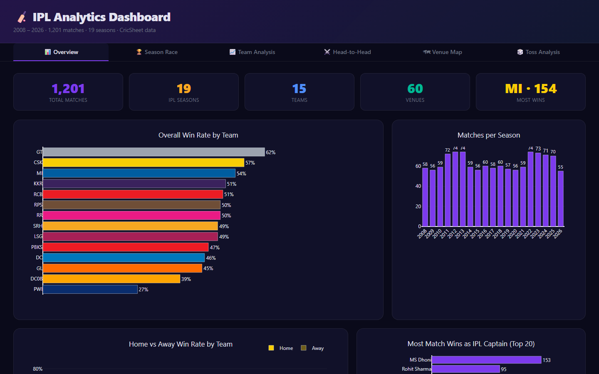
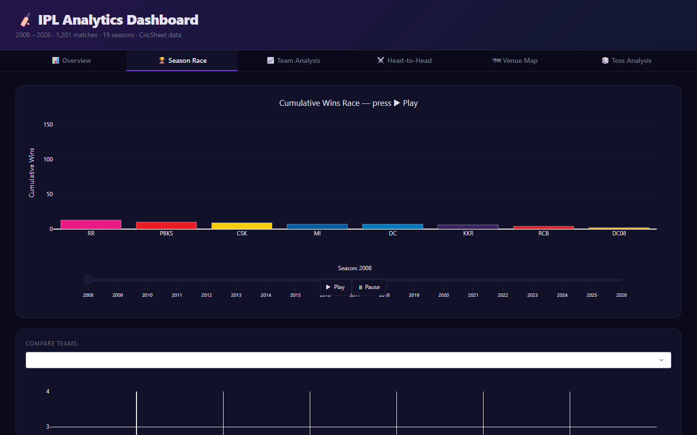
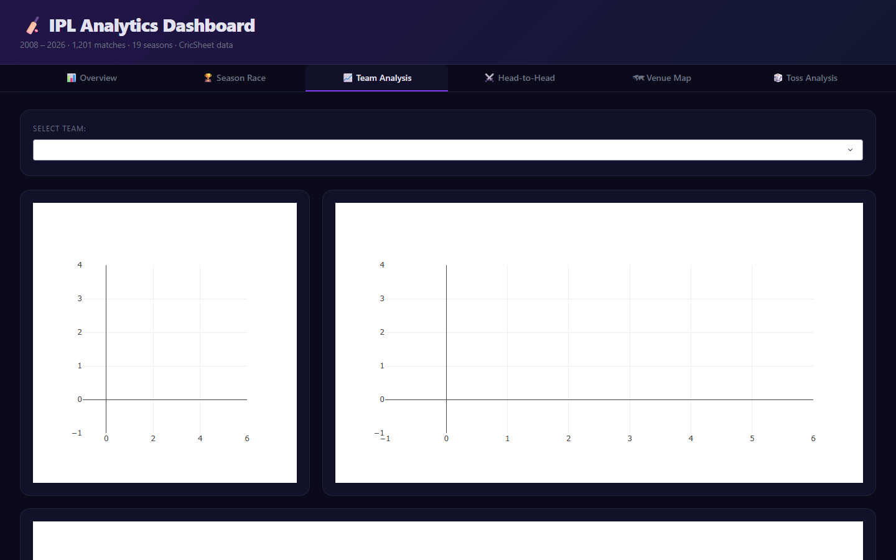
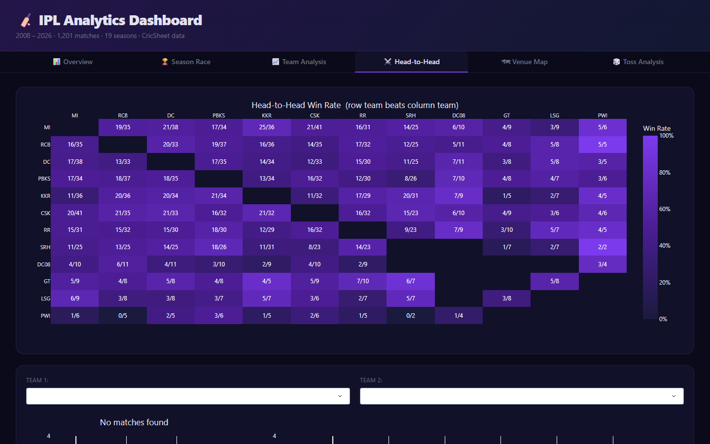
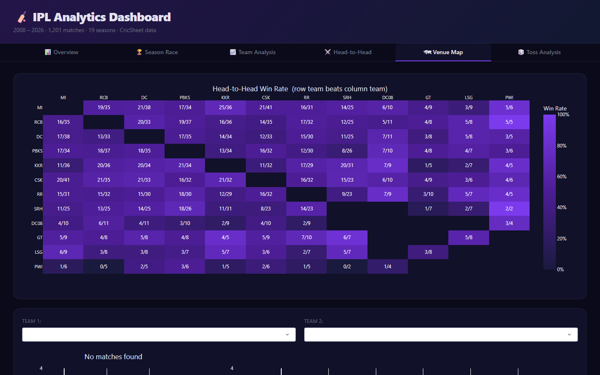
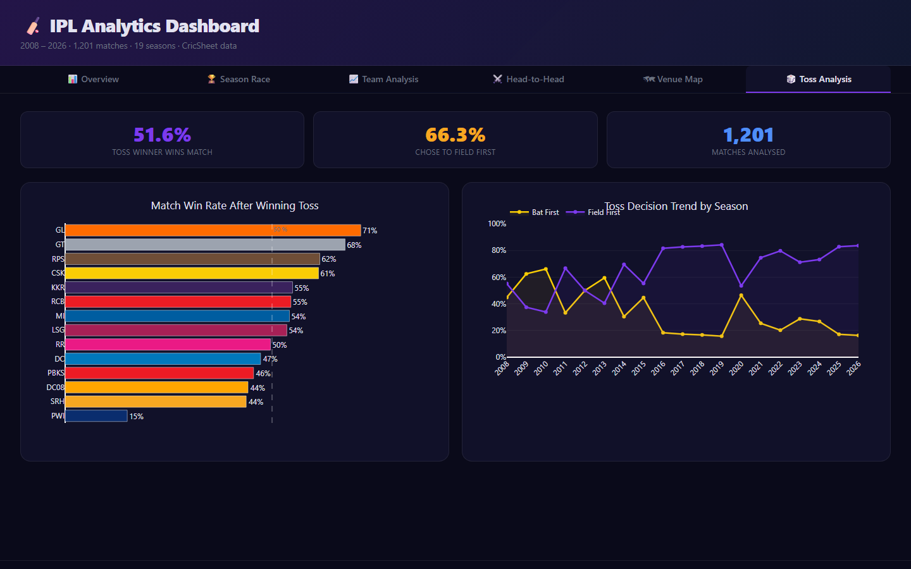

<div align="center">

# 🏏 IPL Analytics Dashboard

**Live Demo:** https://ipl-analytics-db.onrender.com

**An interactive, dark-themed analytics dashboard covering 18 years (2008–2026) of Indian Premier League data, built entirely in Python with Plotly Dash.**

[](https://python.org)
[](https://dash.plotly.com)
[](https://plotly.com)
[](https://pandas.pydata.org)
[](LICENSE)

> *1,201 real matches · 19 franchises · 6 interactive tabs · animated charts · zero JavaScript required*

</div>

---

## Preview

| | |
|:---:|:---:|
|  |  |
| **📊 Overview**, KPIs, win rates, home/away, captain leaderboard | **🏆 Season Race**, animated cumulative wins bar chart race |
|  |  |
| **📈 Team Analysis**, radar profile + season breakdown | **⚔️ Head-to-Head**, 12×12 rivalry win-rate heatmap |
|  |  |
| **🗺 Venue Map**, India geo map + bat-first win% | **🎲 Toss Analysis**, toss impact by team + trend over seasons |

---

## What Is This?

This is a standalone Python analytics dashboard that lets you explore every IPL match ever played, from the inaugural 2008 season through mid-2026. You get animated visualisations, interactive cross-filters, a geo map of India, a head-to-head rivalry matrix, a captain wins leaderboard, and more, all running from a single Python file.

**No React. No Node.js. No JavaScript. Just Python.**

---

## Quick Start

```bash
# 1. Clone the repo
git clone https://github.com/OzSpidey/ipl-analytics-dashboard.git
cd ipl-analytics-dashboard

# 2. Create a virtual environment
python -m venv venv
source venv/bin/activate        # Mac/Linux
# or: venv\Scripts\activate     # Windows

# 3. Install dependencies (only 5 packages)
pip install -r requirements.txt

# 4. Launch the dashboard
python dashboard.py
```

Open **http://localhost:8050** in your browser. That's it, the data is already bundled in `data/matches.csv`.

---

## Six Interactive Tabs

### 📊 Overview


The landing tab gives you the full picture at a glance.

- **KPI tiles**, Total matches (1,201), seasons (19), franchises (15), venues (60), and the all-time most successful team with their win count
- **Overall Win Rate**, Horizontal bar chart for every franchise, coloured in official brand colours, sorted by dominance. GT lead at 62%, CSK at 57%, MI at 54%
- **Matches per Season**, Bar chart showing how the league has grown from 58 games in 2008 to 74+ in modern seasons
- **Home vs Away Win Rate**, Grouped bars showing every team's win rate at home vs on the road. Reveals fortress builders (CSK: 67% home) and road warriors
- **Most Wins as IPL Captain**, Leaderboard of all-time match wins as captain. MS Dhoni dominates at 153, followed by Rohit Sharma (95) and Virat Kohli (85)

---

### 🏆 Season Race


Watch the IPL title race unfold in real time.

- **Animated Bar Chart Race**, Press â–¶ Play and watch cumulative wins pile up season by season, 2008 to 2026. Each bar is in the team's official IPL colour. Drag the season slider to jump to any year, or pause mid-animation
- **Season Win Rate Line Chart**, Multi-team comparison showing win rate trajectory across all seasons. Select any combination of teams from the dropdown to compare dynasties, declines, and comeback stories

---

### 📈 Team Analysis


Deep-dive into any franchise's complete history.

- **Team Selector**, Choose any of the 10+ franchises from the dropdown; all three charts below update instantly
- **Performance Radar**, A 5-axis spider chart covering: Win Rate, Recent Form, Consistency (inverse std-dev of season win rates), Experience (relative match count), and Titles. Instantly shows a team's strengths and weaknesses at a glance
- **Season Wins & Losses**, Stacked bar chart showing wins (team colour) and losses (muted white) for every season that team participated in
- **Home vs Away Breakdown**, Bar chart comparing the selected team's home and away win rates, with a computed "Home advantage: +X%" annotation

---

### ⚔️ Head-to-Head


The full rivalry matrix and drill-down detail panel.

- **Win Rate Heatmap Matrix**, A 12×12 grid where every cell shows Team A's win rate against Team B. Deeper purple = Team A dominates. Every cell is annotated with the exact record (e.g. "21/41" = 21 wins from 41 encounters). CSK vs MI is the most-played rivalry in the league at 41 matches
- **Rivalry Detail**, Choose any two teams from the dropdowns to see an overall win-count bar chart plus a season-by-season grouped bar so you can pinpoint exactly when momentum shifted

---

### 🗺 Venue Map


Where cricket is played across India, and who wins where.

- **India Geo Map**, Every IPL venue plotted on an interactive map of India. Bubble **size** encodes how many matches were hosted there; bubble **colour** (blue → red gradient) shows whether batting first or chasing wins more often at that ground
- **Bat-First Win % Bar Chart**, Every venue with 10+ matches ranked by batting-first win percentage. A dashed line marks 50%. Instantly reveals dew-heavy venues where chasing dominates vs dry grounds that favour setting a target

---

### 🎲 Toss Analysis


How much does the coin flip actually matter?

- **KPI tiles**, Overall rate at which the toss winner wins the match, percentage choosing to field first, and total matches analysed
- **Toss-to-Win Rate by Team**, Some teams convert toss wins into match wins at 55%+ while others barely benefit. This chart ranks every franchise so you can see who capitalises most
- **Toss Decision Trend**, Line chart showing how the split between "bat first" and "field first" has evolved across all 18 seasons. The dramatic shift toward chasing, accelerated after 2016 by dew, bigger T20 scores, and strategic evolution, is clearly visible

---

## Tech Stack

| Layer | Library | Purpose |
|:---|:---|:---|
| Dashboard framework | [Plotly Dash](https://dash.plotly.com) | Web app, reactive callbacks, component tree |
| Charts | [Plotly](https://plotly.com/python) | All visualisations incl. animated bar race + geo map |
| Data wrangling | [pandas](https://pandas.pydata.org) + [NumPy](https://numpy.org) | All aggregations, win-rate calcs, home/away logic |
| Theme base | [dash-bootstrap-components](https://dash-bootstrap-components.opensource.faculty.ai) | CYBORG dark theme |
| Custom styling | `assets/dashboard.css` | Dark glassmorphism, dropdown dark mode, scrollbar |
| Data source | [CricSheet](https://cricsheet.org) | 1,201 real IPL matches (2008–2026) |

---

## Project Structure

```
ipl-analytics-dashboard/
│
├── dashboard.py          # The entire application, layout, charts, callbacks
│
├── assets/
│   └── dashboard.css     # Dark theme: dropdowns, scrollbar, Plotly controls
│
├── data/
│   └── matches.csv       # 1,201 IPL matches (2008–2026), from CricSheet
│
├── screenshots/          # Tab screenshots (used in this README)
├── requirements.txt      # 5 dependencies only
└── README.md
```

---

## Data Coverage

The dataset is sourced from **[CricSheet.org](https://cricsheet.org)**, the gold-standard open-source cricket dataset providing ball-by-ball JSON for every IPL match since the inaugural 2008 season.

| Era | Franchises | Notes |
|:---|:---|:---|
| 2008–2012 | 8–10 teams | Includes Deccan Chargers, Kochi Tuskers Kerala, Pune Warriors India |
| 2013–2015 | 8 teams | Sunrisers Hyderabad replace Deccan Chargers |
| 2016–2017 | 8 teams | Rising Pune Supergiant & Gujarat Lions replace banned CSK & RR |
| 2018–2021 | 8 teams | CSK and RR return |
| 2022–2026 | 10 teams | Lucknow Super Giants & Gujarat Titans join |

**1,201 matches · 19 franchises · 60 venues · 19 seasons**

---

## Highlights From the Data

A few things the dashboard surfaces that might surprise you:

- **MS Dhoni: 153 wins as captain**, more than Rohit Sharma (95) and Virat Kohli (85) combined, and those two are second and third all-time
- **CSK's home advantage is the strongest in the league**, 67% win rate at Chepauk vs 52% away, a 15-point gap no other franchise comes close to
- **MI beat CSK 21 times out of 41 encounters**, the most-played rivalry in IPL history, and MI edges it by a nose (51.2%)
- **The fielding-first revolution**, in 2008, fewer than 40% of toss-winning captains chose to field. By 2022 it was over 70%
- **David Warner: 58 captain wins with SRH**, more than all but four captains in IPL history, despite only captaining for ~7 seasons

---

## Running on a Different Port

Edit the last line of `dashboard.py`:

```python
app.run(debug=False, port=8051, host="0.0.0.0")  # change port here
```

---

## Related Project

This dashboard is a companion to the **[IPL Match Winner Predictor](https://github.com/OzSpidey/ipl-match-predictor)**, a full-stack ML application (FastAPI + React) that predicts IPL match outcomes using a calibrated ensemble of Logistic Regression, Random Forest, XGBoost, and LightGBM trained on the same CricSheet dataset. It includes a live What-If Simulator where you can drag sliders to adjust team form, venue strength, and toss outcome, watching the win probability update in real time.

---

## Data Attribution

Match data sourced from **[CricSheet.org](https://cricsheet.org)**, maintained by Stephen Rushe. Used for educational and non-commercial purposes under the [CC BY-SA 4.0](https://creativecommons.org/licenses/by-sa/4.0/) licence.

---

<div align="center">

Built with Python, Plotly Dash, and 18 years of cricket data.

**[IPL Match Predictor](https://github.com/OzSpidey/ipl-match-predictor)** · **[CricSheet Data](https://cricsheet.org)**

</div>

